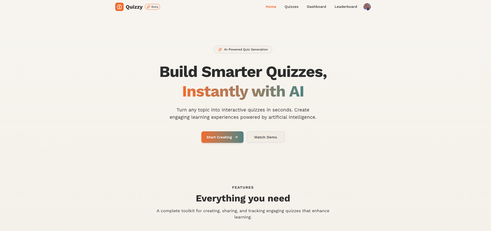
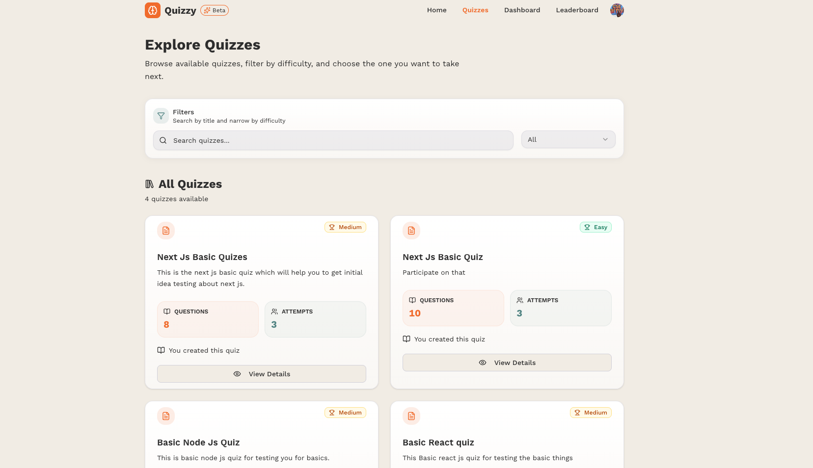
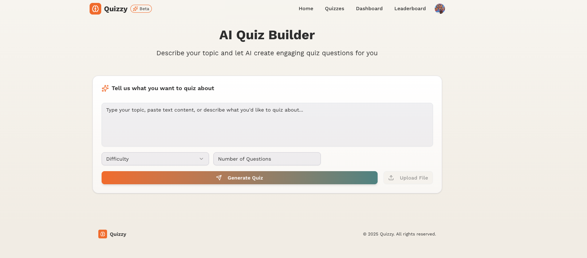
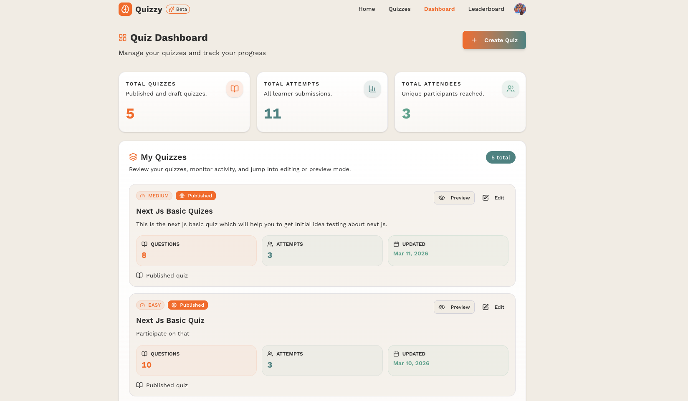
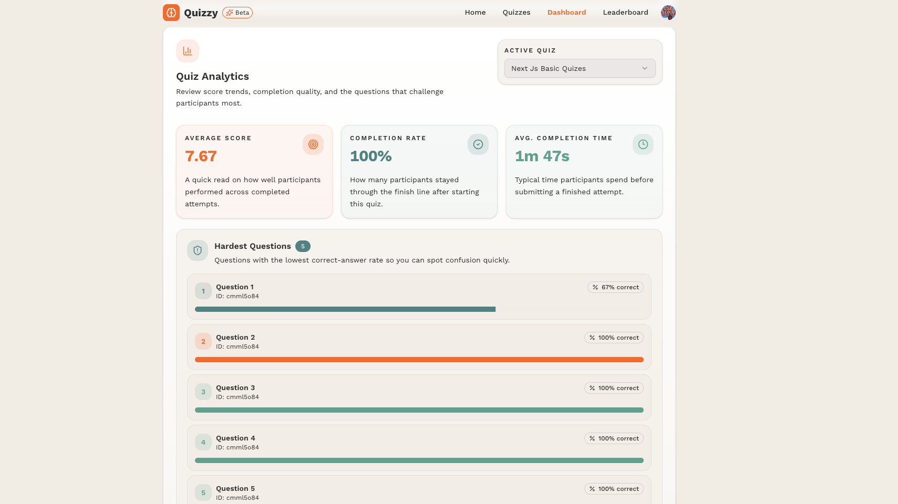
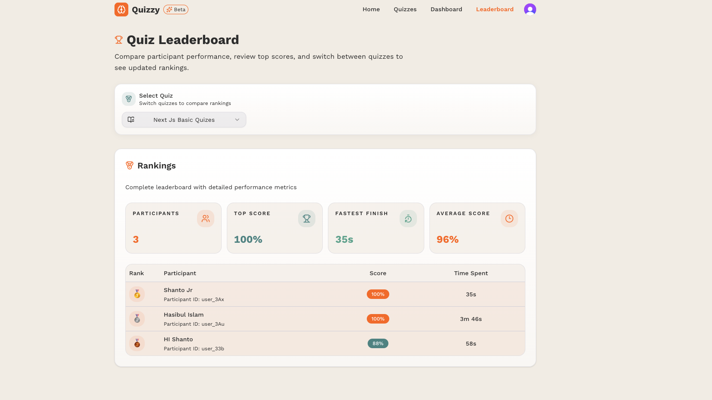
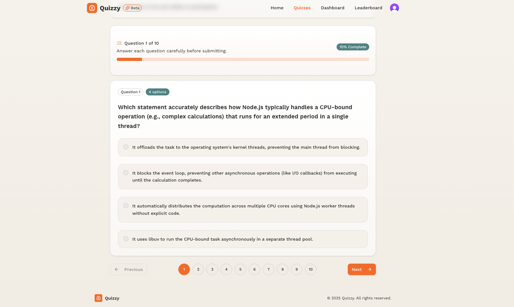
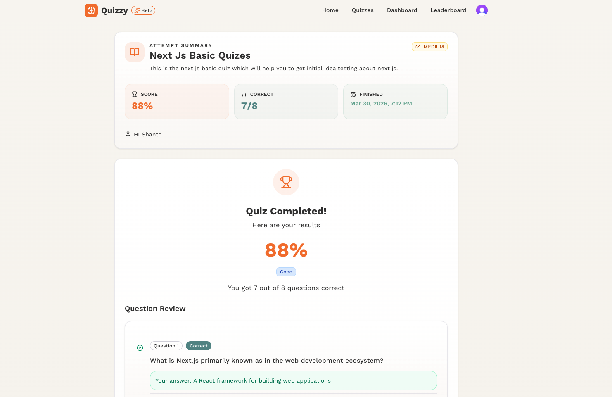
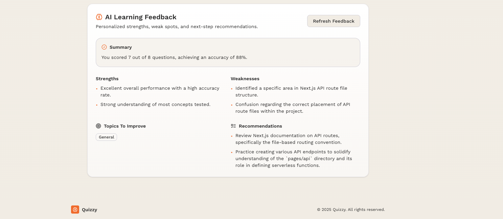

# Quizzy

Quizzy is a full-stack AI quiz platform for creating, publishing, attempting,
and analyzing quizzes. The application supports the full quiz lifecycle:
AI-assisted question generation, creator-side quiz management, learner attempts,
score review, AI feedback, and leaderboard tracking.

Built with Next.js App Router, Prisma, Clerk, PostgreSQL, and Gemini, the
project is designed as a production-style learning product with authenticated
creator workflows, protected learner flows, and structured AI integrations.

## Project Summary

Quizzy solves two core problems:

- creators need a faster way to generate and manage high-quality quizzes
- learners need a clean flow for discovering quizzes, completing attempts, and
  reviewing performance

The platform combines AI-assisted content generation with standard product
workflows such as authentication, publishing, dashboard analytics, protected
result pages, and leaderboard visibility.

## Key Features

### Creator Features

- Generate quiz questions from a text prompt using AI
- Create, edit, and publish quizzes
- Manage quizzes from a creator dashboard
- Track quiz activity, attempts, and leaderboard performance
- Review question sets before publishing

### Learner Features

- Browse published quizzes
- Search and filter quizzes by difficulty
- Start and continue quiz attempts
- Submit answers with progress tracking
- Review detailed results and explanations
- Generate AI-based feedback after submission

### Platform Features

- Clerk-based authentication and route protection
- Prisma + PostgreSQL persistence
- Server Actions for data mutations and reads
- AI rate limiting for generation flows
- End-to-end and unit test coverage

## Screenshots

### Home

The landing page presents the product, highlights AI-assisted quiz creation, and
directs users into authentication and discovery flows.



### Quiz List

The public quiz listing page allows learners to browse available quizzes, search
by title, and filter by difficulty before opening quiz details.



### Quiz Creation

This flow enables creators to generate question sets from prompts, review AI
output, and prepare quizzes for publishing.



### Quiz Dashboard

The dashboard gives creators an operational view of their quizzes, including
quick stats, owned quizzes, and management actions.



### Quiz Analytics

The analytics panel helps creators understand learner behavior through score
trends, completion signals, and difficult-question insights.



### Leaderboard

The leaderboard highlights participant rankings, scores, and completion timing
for published quizzes.



### Quiz Attempt

The attempt flow provides a focused learner experience with progress tracking,
guided navigation, and answer selection.



### Result Section

After submission, learners receive a structured score summary and an
answer-by-answer review of their performance.



### Feedback

The feedback section adds AI-generated learning insights such as strengths, weak
areas, and practical recommendations.



## Tech Stack

### Frontend

- Next.js 15
- React 19
- TypeScript
- Tailwind CSS v4
- Radix UI
- Lucide React
- Sonner

### Backend

- Next.js Server Actions
- Prisma ORM
- PostgreSQL
- Clerk Authentication

### AI and Validation

- Google Gemini via `@google/genai`
- Zod for schema validation and structured parsing
- AI-powered quiz generation
- AI-powered question validation
- AI-generated attempt feedback

### Tooling and Quality

- Playwright
- Vitest
- ESLint
- Prettier
- Husky

## Architecture Overview

Quizzy follows a layered structure that keeps UI, domain logic, and
infrastructure concerns separated.

### Application Layer

`app/` contains App Router routes, layouts, route-specific components, and
Server Actions.

Main route groups:

- `app/(main)/quiz-builder`
- `app/(main)/quizzes`
- `app/(main)/quiz-dashboard`
- `app/(main)/quiz-leaderboard`
- `app/(main)/attempts`

### Domain Layer

`features/` contains entities, repository functions, business helpers, and
validation rules for the core modules:

- `features/quiz`
- `features/questions`
- `features/attempt`
- `features/ai`
- `features/user`

### Infrastructure Layer

`infrastructure/` contains system integrations and lower-level services:

- `infrastructure/prisma` for schema and persistence
- `infrastructure/ai` for Gemini services and rate-limit logic

### UI Layer

- `components/ui` contains reusable UI primitives
- route-specific UI lives near the page that owns it

## Project Structure

```text
quizzy/
├── app/
│   ├── (main)/
│   │   ├── ai/
│   │   ├── attempts/
│   │   ├── quiz-builder/
│   │   ├── quiz-dashboard/
│   │   ├── quiz-leaderboard/
│   │   └── quizzes/
│   ├── api/
│   └── globals.css
├── components/
│   └── ui/
├── e2e/
├── features/
│   ├── ai/
│   ├── attempt/
│   ├── questions/
│   ├── quiz/
│   └── user/
├── hooks/
├── infrastructure/
│   ├── ai/
│   └── prisma/
├── lib/
├── providers/
├── screenshots/
└── store/
```

## Product Flows

### Creator Flow

1. Authenticate with Clerk
2. Generate quiz questions from a prompt
3. Review and edit generated content
4. Publish the quiz
5. Monitor attempts, rankings, and analytics

### Learner Flow

1. Browse published quizzes
2. Filter by search and difficulty
3. Start or continue an attempt
4. Submit answers
5. Review score breakdown and AI feedback

## Setup

### Prerequisites

- Node.js
- npm
- PostgreSQL database
- Clerk project credentials
- Gemini API key

### Environment Variables

Create a `.env` file in the project root:

```bash
DATABASE_URL=postgresql://...
NEXT_PUBLIC_CLERK_PUBLISHABLE_KEY=...
CLERK_SECRET_KEY=...
NEXT_PUBLIC_CLERK_SIGN_IN_URL=/sign-in
NEXT_PUBLIC_CLERK_SIGN_UP_URL=/sign-up
NEXT_PUBLIC_CLERK_AFTER_SIGN_IN_URL=/
NEXT_PUBLIC_CLERK_AFTER_SIGN_UP_URL=/
GEMINI_API_KEY=...
```

### Installation

```bash
npm install
```

### Prisma Setup

```bash
npx prisma generate
npx prisma migrate deploy
```

For local schema iteration:

```bash
npx prisma migrate dev
```

### Run Locally

```bash
npm run dev
```

Application URL:

```bash
http://localhost:3000
```

## Available Scripts

```bash
npm run dev
npm run build
npm run start
npm run lint
npm run lint:fix
npm run type-check
npm run format
npm run test
npm run test:run
npm run test:e2e
npm run test:e2e:ui
```

## Testing

### Unit Testing

Vitest is used for domain-level test coverage, including:

- quiz validation
- question validation
- attempt helpers
- ranking and performance logic

Run:

```bash
npm run test:run
```

### End-to-End Testing

Playwright covers primary user journeys such as:

- quiz browsing
- difficulty filtering
- protected route access
- public navigation

Run:

```bash
npm run test:e2e
```

## Design Notes

The design system is defined in [app/globals.css](./app/globals.css).

Primary visual tokens include:

- warm beige backgrounds
- orange primary actions
- teal secondary accents
- soft gradient cards
- subtle border and shadow treatments

## Security and Access Model

- public quiz pages only expose published learner-safe quiz data
- attempt pages do not expose answers before submission
- attempt result pages are ownership-protected
- creator-only quiz views are restricted to the quiz owner
- AI generation features require authentication
- generation requests are rate-limited through
  `infrastructure/ai/ai-rate-limit.service.ts`

## Deployment Notes

- production builds run through `npm run build`
- Prisma schema is located at
  [infrastructure/prisma/schema.prisma](./infrastructure/prisma/schema.prisma)
- apply migrations before serving production traffic
- configure Clerk and Gemini secrets in the deployment environment

## License

This repository does not currently include a license file.
